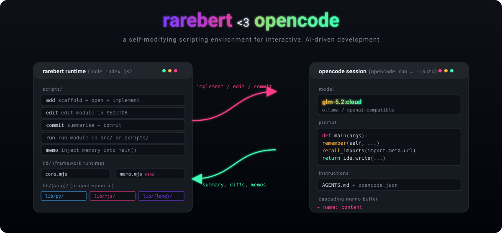
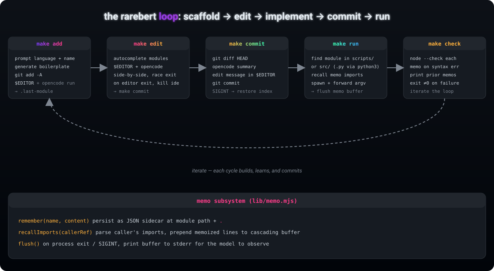

# rarebert <3 opencode

> ⚠️ **Work in Progress** — This branch is a work in progress and should not be currently used.



A self-modifying scripting environment for interactive, AI-driven
development. Rarebert scaffolds modules, opens them in your editor side-by-side
with [opencode], lets the model implement them, summarises the diff, and
commits \u2014 then runs the result and remembers what happened.

> Built around two pieces: a small **Node.js runtime** (`index.js` + `lib/`)
> that orchestrates `$EDITOR`, `git`, and `opencode`, and a **memo subsystem**
> that threads observations between the model and your shell.

## The loop



```sh
make add       # scaffold a module, git add, $EDITOR + opencode implement
make edit      # pick a module, $EDITOR + opencode side-by-side, then commit
make commit    # opencode summarises the diff, edit the message, git commit
make run       # run a module from scripts/ or src/ (python3)
make check     # node --check every module, memo on syntax error
make analyze   # source-map, import graph, dependency trace, usage scan
make analyze   # source-map, import graph, dependency trace, usage scan
```

Each turn ends in a commit, so the working tree is always clean before the next
cycle. Memos from `check` (and any other script) surface on stderr the next
time the model is invoked, so failures teach the next attempt.

## Analyze & trace

`make analyze` (or `node index.js analyze`) introspects the codebase:

```sh
node index.js analyze [module...]              # condensed source map per module
node index.js analyze [module...] --oneline    # one-line summary
node index.js analyze [module...] --graph      # resolved import graph
node index.js analyze --trace module::name     # forward dependency chain
node index.js analyze --trace mod::outer::inner  # nested declaration trace
node index.js analyze --usage module::name     # reverse: all project-wide references
node index.js analyze --usage module::name --yes  # auto-memoize references
node index.js analyze --document [module]      # opencode documentation pass
node index.js analyze --clear-cache            # reset introspect cache
```

The `Trace` class (`lib/introspect.mjs`) powers both directions:

- **`Trace.forward()`** — walks imports and declarations down the dependency
  chain from a binding to its roots. Supports `module::name` and nested
  `module::outer::inner::local` paths.
- **`Trace.usage()`** — reverse scan: finds every file:line that imports or
  re-exports a given binding across the entire project. Results can be
  memoized onto the target module with `--yes`.

## Runtime cascade

Every script returns an `ExitSignal` from `exit()`. The cascade is:

```
main callback → return exit(code) or exit(new TUI(...))
  → Module.exit(result)     # validates, runs onExit hooks
    → process.exit(code)    # sole terminal exit point
```

- `exit(0)` — success
- `exit(1)` — failure
- `exit('error message')` — prints to stderr, exits 1
- `exit(new TUI(name, main, meta))` — delegates to a TUI submodule
- `exit(new CLI(name, main, meta))` — delegates to a CLI submodule

`AbortError` carries an `exitCode` for library functions that need to abort
without calling `process.exit()` directly. The cascade catches it and exits
with the appropriate code.

### TUI-delegation pattern

Interactive scripts use `return exit(new TUI(...))` to delegate from a CLI
callback to a full-screen TUI. The TUI's `execute()` guards against
non-interactive stdin automatically. See `scripts/analyze.mjs` for the
canonical shape.

## Analyze & trace

`make analyze` (or `node index.js analyze`) introspects the codebase:

```sh
node index.js analyze [module...]              # condensed source map per module
node index.js analyze [module...] --oneline    # one-line summary
node index.js analyze [module...] --graph      # resolved import graph
node index.js analyze --trace module::name     # forward dependency chain
node index.js analyze --trace mod::outer::inner  # nested declaration trace
node index.js analyze --usage module::name     # reverse: all project-wide references
node index.js analyze --usage module::name --yes  # auto-memoize references
node index.js analyze --document [module]      # opencode documentation pass
node index.js analyze --clear-cache            # reset introspect cache
```

The `Trace` class (`lib/introspect.mjs`) powers both directions:

- **`Trace.forward()`** — walks imports and declarations down the dependency
  chain from a binding to its roots. Supports `module::name` and nested
  `module::outer::inner::local` paths.
- **`Trace.usage()`** — reverse scan: finds every file:line that imports or
  re-exports a given binding across the entire project. Results can be
  memoized onto the target module with `--yes`.

## Runtime cascade

Every script returns an `ExitSignal` from `exit()`. The cascade is:

```
main callback → return exit(code) or exit(new TUI(...))
  → Module.exit(result)     # validates, runs onExit hooks
    → process.exit(code)    # sole terminal exit point
```

- `exit(0)` — success
- `exit(1)` — failure
- `exit('error message')` — prints to stderr, exits 1
- `exit(new TUI(name, main, meta))` — delegates to a TUI submodule
- `exit(new CLI(name, main, meta))` — delegates to a CLI submodule

`AbortError` carries an `exitCode` for library functions that need to abort
without calling `process.exit()` directly. The cascade catches it and exits
with the appropriate code.

### TUI-delegation pattern

Interactive scripts use `return exit(new TUI(...))` to delegate from a CLI
callback to a full-screen TUI. The TUI's `execute()` guards against
non-interactive stdin automatically. See `scripts/analyze.mjs` for the
canonical shape.

## Repository layout

The project at /workspaces/development/personal/rarebert has this key structure:

```bash
rarebert/
├── index.js                          # Entry point - dispatches commands
├── package.json
├── AGENTS.md
├── README.md
├── Makefile
├── .git/
├── .gitignore
├── .opencode/                        # Temporary/work scratches
├── lib/                              # Core library modules
│   ├── core.mjs                      # ExitSignal, exit(), Store, AbortError
│   ├── module.mjs                    # Module, CLI, TUI classes, cli singleton
│   ├── introspect.mjs                # Trace class, buildGraph, traceBinding
│   ├── projects.mjs                  # Project class, home/rarebert singletons
│   ├── memo.mjs                      # Memo management system
│   ├── check.mjs                     # Integrity checks, reverse trace
│   └── ... (other lib modules)
└── scripts/                          # CLI command modules
    ├── analyze.mjs                   # Source map, trace, usage scan
├── lib/                              # Core library modules
│   ├── core.mjs                      # ExitSignal, exit(), Store, AbortError
│   ├── module.mjs                    # Module, CLI, TUI classes, cli singleton
│   ├── introspect.mjs                # Trace class, buildGraph, traceBinding
│   ├── projects.mjs                  # Project class, home/rarebert singletons
│   ├── memo.mjs                      # Memo management system
│   ├── check.mjs                     # Integrity checks, reverse trace
│   └── ... (other lib modules)
└── scripts/                          # CLI command modules
    ├── analyze.mjs                   # Source map, trace, usage scan
    ├── check.mjs                     # Syntax + integrity + memos
    ├── commit.mjs                    # Git commit with opencode summaries
    └── ... (other script files)
```

Key patterns:

- Every scripts/*.mjs exports a default new CLI('name.mjs', main, meta) instance
- Interactive branches delegate via return exit(new TUI(name, main, meta))
- Interactive branches delegate via return exit(new TUI(name, main, meta))
- index.js discovers modules via home.discoverModules() and runs them
- lib/memo.mjs provides the memo infrastructure used by multiple scripts

A **module** is a file inside one of a project's constituent folders — `./`,
`scripts/`, `lib/`, `lib/supports/`, or `src/`. `rarebert.discover()` returns
these folders, and every module is constructed from `(project, file)` via
`lib/modules.mjs`. See [docs/modules.md](docs/modules.md) for the full
description and loading rules.

### Project-specific libraries: `lib/{lang}/`

The `lib/` root holds the framework runtime (`.mjs` files imported by
`scripts/`). Project-specific libraries — the actual code your modules call —
live in language subdirectories:

```
lib/py/                 # python libraries, import via `from lib.py import X`
  __init__.py
  datasetloader.py
  postagger.py
lib/mjs/                # JS libraries, import via '../lib/mjs/X.mjs'
  ...
lib/{lang}/             # any installed language gets its own subdir
```

`make create` (python scaffolding) scans `lib/py/` for libraries and offers
them as preamble imports; `make add` (JS scaffolding) wires peer imports from
`lib/{lang}/` into the boilerplate. Install a new language with
`make languages install <lang>`.

## Setup

```sh
git clone https://github.com/akinevz2/rarebert
cd rarebert
npm install        # pulls opencode-ai + enquirer
make reload        # rebuild Makefile to match scripts/
make install       # install rarebert to ~/.local/rarebert (user-controlled prefix)
```

`make install` invokes `node index.js install`, which installs the package
into `~/.local/rarebert` (override with `--prefix <dir>`) and symlinks
`rarebert` into `<prefix>/bin`. Add that `bin/` to your `PATH` to use the CLI.

Then point `opencode.json` at your model. The default expects an
Ollama-compatible endpoint:

```jsonc
{
    "model": "ollama/glm-5.2:cloud",
    "provider": {
        "ollama": {
            "npm": "@ai-sdk/openai-compatible",
            "options": { "baseURL": "http://localhost:11434/v1" },
            "models": { "glm-5.2:cloud": { "name": "GLM 5.2 Cloud" } }
        }
    }
}
```

## Day-to-day

```sh
make add           # choose language + name → scaffold → $EDITOR → opencode implements
make implement     # rerun opencode on the module named in .last-module
make edit          # pick any module → $EDITOR + opencode → commit
make diff          # working-tree or staged diff in $PAGER
make commit        # opencode summary → edit message → git commit
make memo          # inject a remember() line into a module's main()
make undo          # remove the last-added module + clear .last-module
make reload        # regenerate Makefile after adding/removing scripts
```

### Memos

`lib/memo.mjs` persists one-line observations as JSON sidecars
(`<modulepath>.`) and prepends them to a cascading buffer on the next run:

- `remember(name, content)` — append a memo
- `recallImports(import.meta.url)` — pull memos from a caller's imports
- `flush()` — on exit/SIGINT, print the buffer to stderr (the model sees it)

`make check` writes memos on syntax failures; `make memo` injects
`remember()` lines into a module's `main()` so they fire on every run.

## Article mode

`make article` manages a separate academic report repo under `report/`
(cloned from the `report-template` remote on first use). It builds the PDF,
opens a section in `$EDITOR` + opencode, commits the section, and rebuilds —
keeping the host rarebert repo clean between edits.

## Code style

Formatting is enforced by [Prettier] with the project config in
`.prettierrc.json` (4-space indent, single quotes, 100-col width, LF endings;
SVGs are parsed as HTML so they're left untouched).

```sh
npm run format         # prettier --write lib/ scripts/ index.js *.json *.md
npm run format:check   # CI gate
```

[opencode]: https://opencode.ai
[prettier]: https://prettier.io
