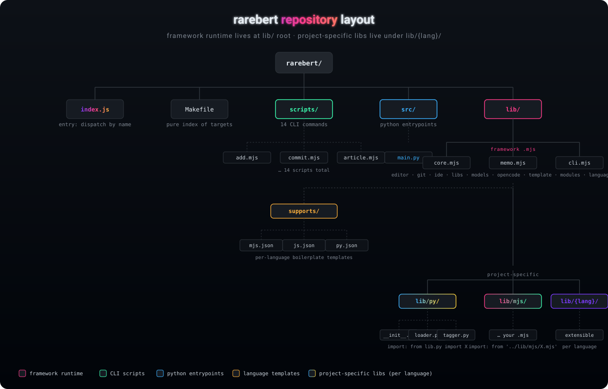

# rarebert <3 opencode


A self-modifying scripting environment for interactive, AI-driven
development. Rarebert scaffolds modules, opens them in your editor side-by-side
with [opencode], lets the model implement them, summarises the diff, and
commits — then runs the result and remembers what happened.

> Built around two pieces: a small **Node.js runtime** (`index.js` + `lib/`)
> that orchestrates `$EDITOR`, `git`, and `opencode`, and a **memo subsystem**
> that threads observations between the model and your shell.

## The loop


```sh
make add       # scaffold a module, git add, $EDITOR + opencode implement
make edit      # pick a module, $EDITOR + opencode side-by-side, then commit
make commit    # opencode summarises the diff, edit the message, git commit
make run       # run a module from scripts/ or src/ (python3)
make check     # node --check every module, memo on syntax error
```

Each turn ends in a commit, so the working tree is always clean before the next
cycle. Memos from `check` (and any other script) surface on stderr the next
time the model is invoked, so failures teach the next attempt.

## Repository layout



```
rarebert/
  index.js              # dispatch by name: node index.js <script>
  Makefile              # auto-generated index of `node index.js <name>` targets
  opencode.json         # provider/model config (ollama, openai-compatible)
  AGENTS.md             # instructions loaded by opencode sessions
  scripts/              # CLI commands (add, edit, commit, run, check, memo, ...)
  src/                  # python entrypoints (run via `make run`)
  lib/                  # framework runtime (.mjs) — DO NOT put project code here
    core.mjs            #   paths, discovery, metadata
    memo.mjs            #   cascading memo buffer
    cli.mjs             #   enquirer wrappers, help, run(meta, main)
    editor.mjs          #   $EDITOR spawning, .last-module marker
    git.mjs             #   allow-listed git wrapper
    ide.mjs             #   opencode launch / graceful exit
    libs.mjs            #   module creation, peer-import discovery
    models.mjs          #   opencode.json model resolution
    modules.mjs         #   module listing + autocomplete prompt
    languages.mjs       #   lib/supports/ template install/resolve
    template.mjs        #   per-language boilerplate rendering
    opencode.mjs        #   bundled binary resolution
    list.mjs            #   `node index.js` (default) listing
    supports/           # per-language boilerplate templates (mjs/js/py .json)
    {lang}/             # project-specific libs (per language, see below)
```

### Project-specific libraries: `lib/{lang}/`

The `lib/` root holds the framework runtime (`.mjs` files imported by
`scripts/`). Project-specific libraries — the actual code your modules call —
live in language subdirectories:

```
lib/py/                 # python libraries, import via `from lib.py import X`
  __init__.py
  datasetloader.py
  postagger.py
lib/mjs/                # JS libraries, import via '../lib/mjs/X.mjs'
  ...
lib/{lang}/             # any installed language gets its own subdir
```

`make create` (python scaffolding) scans `lib/py/` for libraries and offers
them as preamble imports; `make add` (JS scaffolding) wires peer imports from
`lib/{lang}/` into the boilerplate. Install a new language with
`make languages install <lang>`.

## Setup

```sh
git clone https://github.com/akinevz2/rarebert
cd rarebert
npm install        # pulls opencode-ai + enquirer
make reload        # rebuild Makefile to match scripts/
make install       # install rarebert to ~/.local/rarebert (user-controlled prefix)
```

`make install` invokes `node index.js install`, which installs the package
into `~/.local/rarebert` (override with `--prefix <dir>`) and symlinks
`rarebert` into `<prefix>/bin`. Add that `bin/` to your `PATH` to use the CLI.

Then point `opencode.json` at your model. The default expects an
Ollama-compatible endpoint:

```jsonc
{
    "model": "ollama/glm-5.2:cloud",
    "provider": {
        "ollama": {
            "npm": "@ai-sdk/openai-compatible",
            "options": { "baseURL": "http://localhost:11434/v1" },
            "models": { "glm-5.2:cloud": { "name": "GLM 5.2 Cloud" } }
        }
    }
}
```

## Day-to-day

```sh
make add           # choose language + name → scaffold → $EDITOR → opencode implements
make implement     # rerun opencode on the module named in .last-module
make edit          # pick any module → $EDITOR + opencode → commit
make diff          # working-tree or staged diff in $PAGER
make commit        # opencode summary → edit message → git commit
make memo          # inject a remember() line into a module's main()
make undo          # remove the last-added module + clear .last-module
make reload        # regenerate Makefile after adding/removing scripts
```

### Memos

`lib/memo.mjs` persists one-line observations as JSON sidecars
(`<modulepath>.`) and prepends them to a cascading buffer on the next run:

- `remember(name, content)` — append a memo
- `recallImports(import.meta.url)` — pull memos from a caller's imports
- `flush()` — on exit/SIGINT, print the buffer to stderr (the model sees it)

`make check` writes memos on syntax failures; `make memo` injects
`remember()` lines into a module's `main()` so they fire on every run.

## Article mode

`make article` manages a separate academic report repo under `report/`
(cloned from the `report-template` remote on first use). It builds the PDF,
opens a section in `$EDITOR` + opencode, commits the section, and rebuilds —
keeping the host rarebert repo clean between edits.

## Code style

Formatting is enforced by [Prettier] with the project config in
`.prettierrc.json` (4-space indent, single quotes, 100-col width, LF endings;
SVGs are parsed as HTML so they're left untouched).

```sh
npm run format         # prettier --write lib/ scripts/ index.js *.json *.md
npm run format:check   # CI gate
```

[opencode]: https://opencode.ai
[prettier]: https://prettier.io
