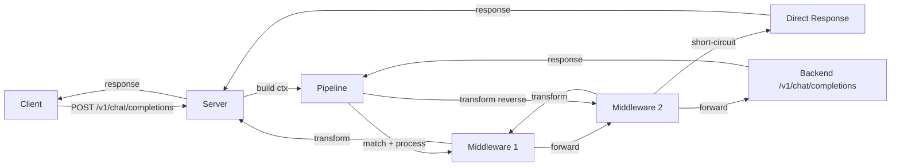

# Middleware Framework

> **Status**: Implemented — `src/server/middleware/`

## Overview

The middleware framework provides a programmable routing pipeline for
the OpenAI-compatible server. Middleware can intercept requests, modify
them, short-circuit (return a direct response), and transform backend
responses.

## Architecture



## Middleware Interface

```typescript
interface Middleware {
    name: string;
    match?(ctx: MiddlewareContext): boolean;
    process?(ctx: MiddlewareContext): Promise<MiddlewareResult>;
    transform?(ctx: MiddlewareContext, response: ChatCompletionResponse): Promise<ChatCompletionResponse>;
}
```

### MiddlewareContext

```typescript
interface MiddlewareContext {
    path: string;           // e.g. "/v1/chat/completions"
    method: string;         // "POST", "GET", etc.
    body: ChatCompletionRequest | null;
    headers: Record<string, string>;
}
```

### MiddlewareResult (discriminated union)

```typescript
// Short-circuit: return a direct response, skip backend
interface ShortCircuitResult {
    type: 'short-circuit';
    status?: number;        // default 200
    body: unknown;          // JSON response body
    contextMessages?: Array<{ role: 'user' | 'assistant'; content: string }>;
}

// Forward: send (possibly modified) request to backend
interface ForwardResult {
    type: 'forward';
    request: ChatCompletionRequest;
}
```

## Pipeline Execution

### Request Phase

1. Build `MiddlewareContext` from the incoming HTTP request.
2. For each middleware (in registration order):
   - Skip if `match()` returns `false` (or is absent → always match).
   - Call `process()`.
   - If result is `ShortCircuitResult` → send direct response, stop.
   - If result is `ForwardResult` → update running request, continue.
3. If no short-circuit → forward the final request to the backend.

### Response Phase

1. Receive backend response.
2. For each middleware (in **reverse** registration order):
   - Skip if `match()` returns `false`.
   - Call `transform()` with the current response.
3. Send the final transformed response to the client.

## Registration

Middleware can be registered at runtime:

```typescript
server.registerMiddleware({
    name: 'my-middleware',
    match(ctx) { return ctx.path === '/v1/chat/completions'; },
    async process(ctx) {
        // Modify request or short-circuit
        return { type: 'forward', request: ctx.body! };
    },
    async transform(ctx, response) {
        // Modify response
        return response;
    },
});
```

Or unregistered:

```typescript
server.unregisterMiddleware('my-middleware');
```

## Built-in Middleware

### BashShortCircuitMiddleware (`src/server/middleware/bash-shortcircuit.ts`)

**Purpose**: Intercept direct bash-command requests, execute them
locally, and return the result as a wrapped assistant message —
without forwarding to the backend.

**How it works**:

1. **Short-circuit phase** (`match` + `process`):
   - Activates for `POST /v1/chat/completions` with user messages.
   - Tokenises the last user message (strips conversational prefixes).
   - Checks if the first token is in the `ALLOWED_COMMANDS` allowlist.
   - Looks up the tokenised pattern in the KV cache, then the database.
   - If a known pattern matches → executes the command locally via
     `child_process.spawn`, returns a `ShortCircuitResult` with the
     output wrapped as an assistant message.
   - If no known pattern but the command is allowlisted → stores it as
     a new pattern and forwards to backend (conservative default).

2. **Introspection phase** (idle trigger):
   - During idle moments (no pending requests for `idleTimeoutMs`),
     the server triggers introspection.
   - Previous conversation messages are sent to the backend model for
     binary classification: "is this a direct bash command request?"
   - If classified as `YES`, the command is tokenised and stored as a
     `BashCommandPattern` in the database + KV cache for future matching.

**Security**: A strict allowlist of read-only, non-destructive commands
is enforced:

```
ls, pwd, cat, echo, grep, head, tail, wc, find, which, whoami,
date, uname, df, du, env, git, node, npm, npx, tsc
```

Commands have a 10-second timeout. Execution uses `child_process.spawn`
with the server's working directory.

**Configuration**:

```typescript
new BashShortCircuitMiddleware({
    baseURL: 'http://localhost:11434/v1',  // backend for classification
    cwd: process.cwd(),                     // working directory for commands
    introspectModel: 'glm-4.7-flash:q8_0', // model for classification
});
```

## Database Schema

### `classified_messages`

| Column | Type | Description |
|--------|------|-------------|
| `id` | INTEGER PK | Auto-increment |
| `message` | TEXT | Original message content |
| `is_bash_command` | INTEGER | 1 = yes, 0 = no |
| `raw_response` | TEXT | Model's raw classification response |
| `classified_at` | INTEGER | Unix timestamp (ms) |

### `bash_command_patterns`

| Column | Type | Description |
|--------|------|-------------|
| `id` | INTEGER PK | Auto-increment |
| `pattern` | TEXT UNIQUE | Canonical command string (e.g. `ls -la`) |
| `tokens` | TEXT | JSON array of normalised tokens |
| `source_message` | TEXT | Original user message |
| `created_at` | INTEGER | Unix timestamp (ms) |

## Future Extensions

1. **Conversation history persistence** — Store conversation messages
   to enable full introspection analysis during idle moments.
2. **Additional middleware** — Model aliasing, rate limiting, request
   rewriting, response caching, logging/metrics.
3. **Pattern matching strategies** — Exact match (current), tokenised
   prefix match, embedding similarity.
4. **Command sandboxing** — Expand allowlist, add denylist, support
   shell pipelines, environment variable injection.
